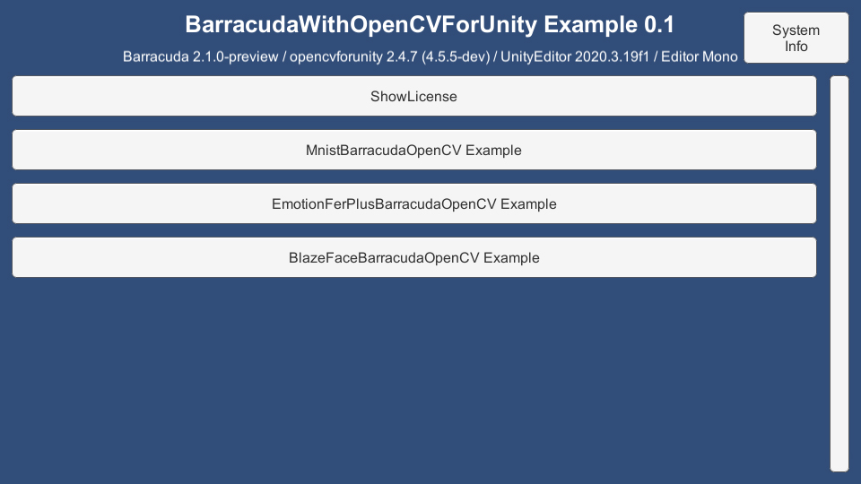
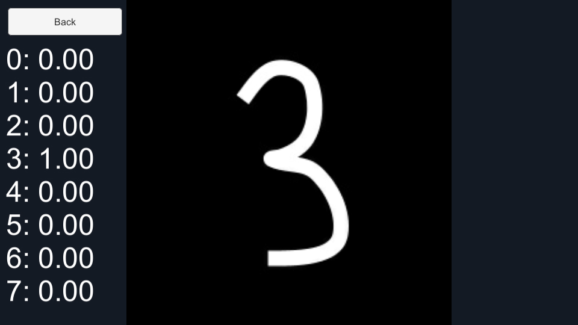
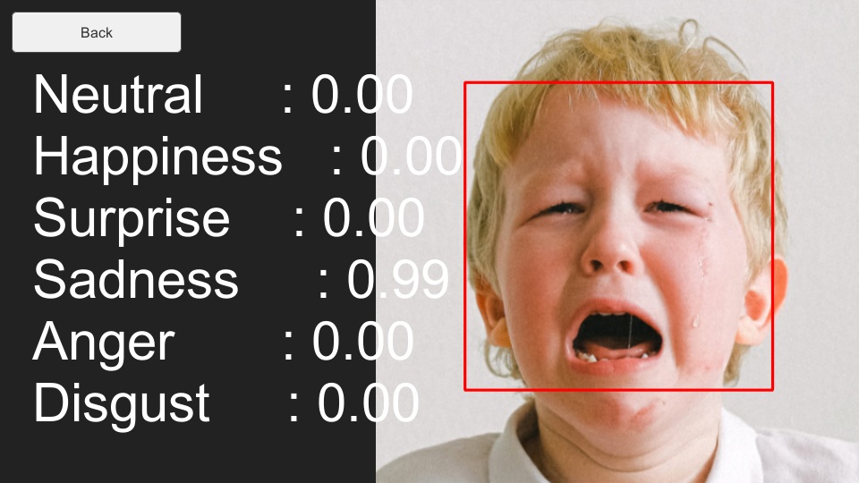
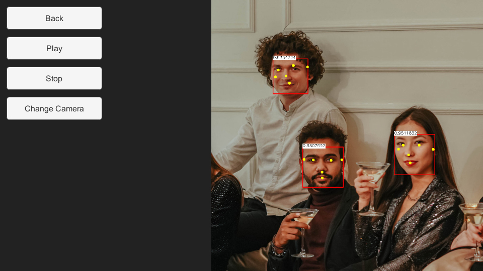

# Barracuda With OpenCVForUnity Example
- An example of integrating Barracuda with OpenCVForUnity.
- A rewritten version of Keijiro's Barracuda examples (https://github.com/search?q=user%3Akeijiro+Barracuda).


## Environment
- Windows / Android (Pixel3a) / iOS (iPhoneSE2)
- Unity >= 2020.3.19f1+
- Scripting backend MONO / IL2CPP
- [Barracuda] 2.1.0-preview+
- [OpenCV for Unity](https://assetstore.unity.com/packages/tools/integration/opencv-for-unity-21088?aid=1011l4ehR) 2.4.7+


## Demo
- Android [BarracudaWithOpenCVForUnityExample.apk](https://github.com/EnoxSoftware/BarracudaWithOpenCVForUnityExample/releases)


## Setup
1. Download the latest release unitypackage. [BarracudaWithOpenCVForUnityExample.unitypackage](https://github.com/EnoxSoftware/BarracudaWithOpenCVForUnityExample/releases)
1. Create a new project. (BarracudaWithOpenCVForUnityExample)
1. Install Barracuda from Package Manager.
1. Install Keijiro's package.
    * [How to install Keijiro's package](#how-to-install-keijiros-package)
1. Import OpenCVForUnity.
    * Setup the OpenCVForUnity. (Tools > OpenCV for Unity > Set Plugin Import Settings)
1. Import the BarracudaWithOpenCVForUnityExample.unitypackage.
1. Change the "Player Settings (Androd)" Inspector as follows.
    * Graphics APIs : Vulkan (Remove "OpenGLES 3" from the Graphics APIs list)
1. Change the "Player Settings (iOS)" Inspector as follows.
    * Camera Usage Description : "Required for camera support."
1. Add the "Assets/BarracudaWithOpenCVForUnityExample/*.unity" files to the "Scenes In Build" list in the "Build Settings" window.
1. Build and Deploy to Android and iOS.


## How to install Keijiro's package
This package uses the [scoped registry] feature to resolve package dependencies.
Please add the following sections to the manifest file (Packages/manifest.json).

[scoped registry]: https://docs.unity3d.com/Manual/upm-scoped.html

To the `scopedRegistries` section:

```
{
  "name": "Keijiro",
  "url": "https://registry.npmjs.com",
  "scopes": [ "jp.keijiro" ]
}
```

To the `dependencies` section:

```
"jp.keijiro.mediapipe.blazeface": "1.1.1"
```

After changes, the manifest file should look like below:

```
{
  "scopedRegistries": [
    {
      "name": "Keijiro",
      "url": "https://registry.npmjs.com",
      "scopes": [ "jp.keijiro" ]
    }
  ],
  "dependencies": {
    "jp.keijiro.mediapipe.blazeface": "1.1.1",
...
```


## ScreenShot
 
 
 
 
